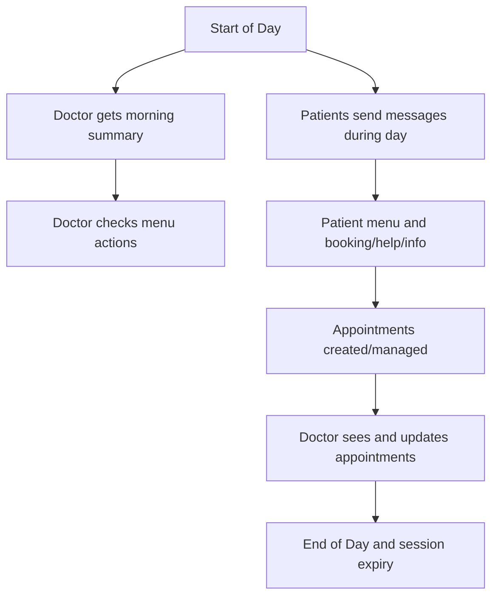
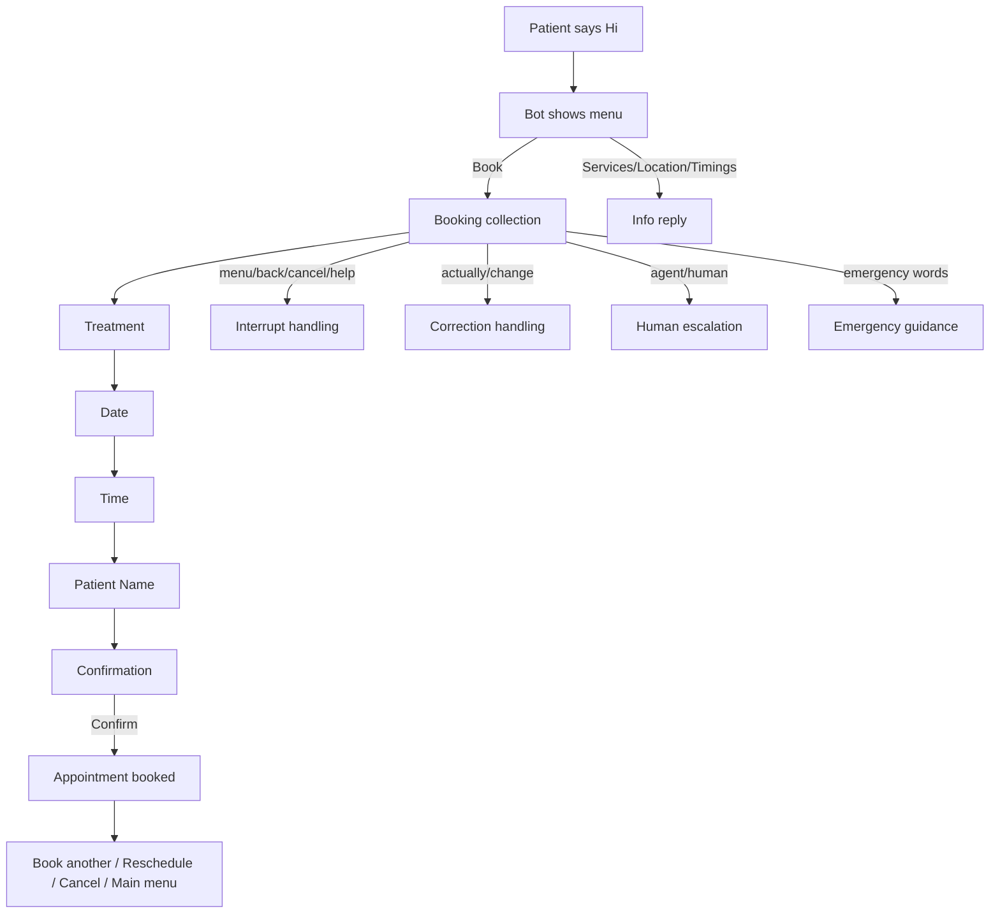
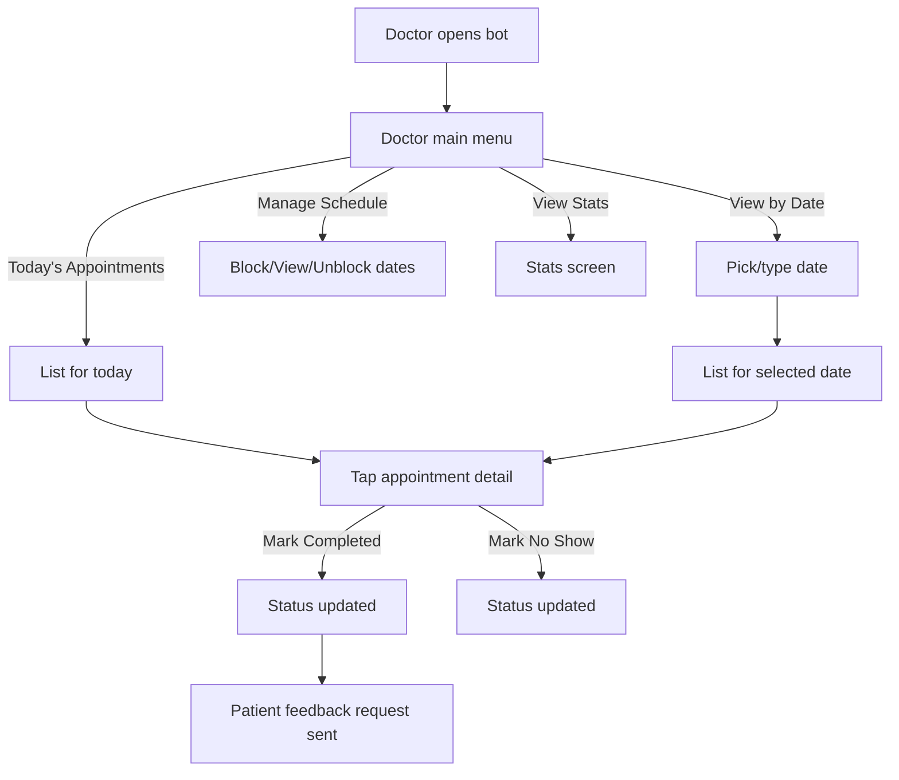
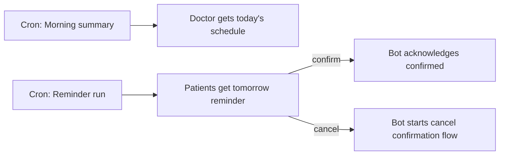
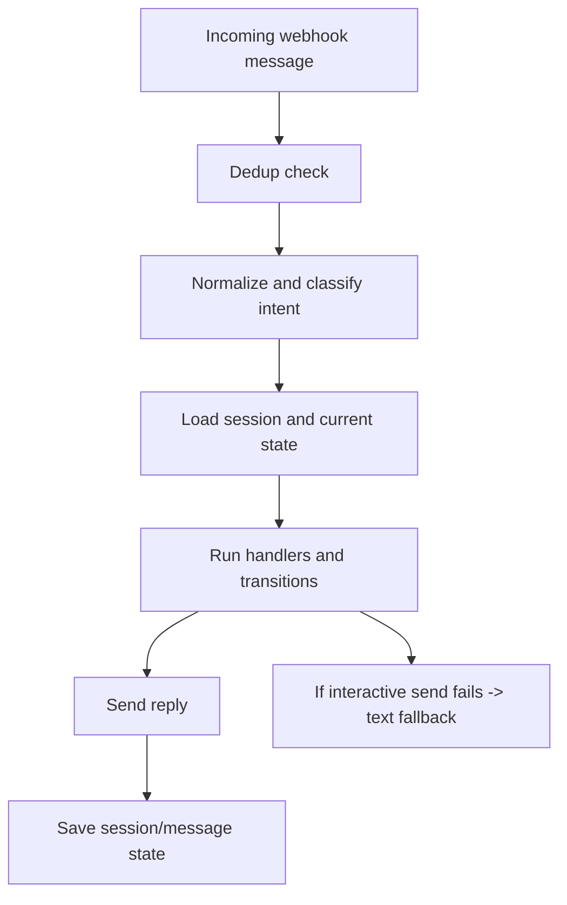

# Daily Flow Visual (Patient + Doctor)

This is a simple visual flow you can share with non-technical team members.

---

## 1) Full Day Overview

---

## 2) Patient Journey

---

## 3) Doctor Journey

---

## 4) Daily Automation

---

## 5) Safety and Reliability

