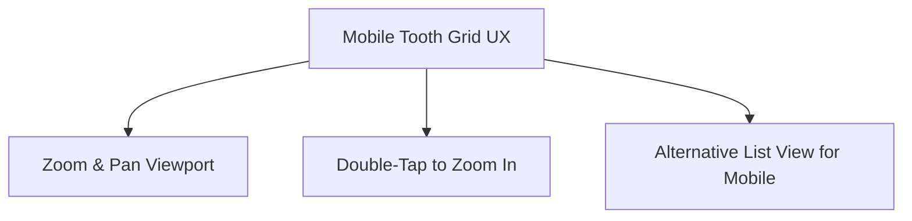

# Frontend Audit & Optimization Plan: Clinic Bot UI/UX

This document provides a comprehensive analysis of the clinic-bot's frontend layout, mobile responsiveness, and overall user experience. It outlines current friction points and proposes concrete UI/UX optimizations, performance improvements, and accessibility enhancements to bring the platform up to production-grade standard.

---

## 1. Clinical Interface: Tooth Grid & Per-Tooth Diagnosis Panel

The dental chart is the core interface of the clinical workflow. While rich in features (FDI numbering, surface diagrams, severity shading), it presents several ergonomic challenges on smaller viewports.

### 🔍 Current Mobile Limitations
* **Ultra-dense Tooth Grid**: 16 columns of teeth on a mobile viewport (e.g., 375px width) results in touch targets that are under 22px wide. This makes selection highly error-prone.
* **Right-Click Context Menu**: The quick-diagnosis context menu relies on mouse right-clicks. Long-press triggers on mobile devices are inconsistent and conflict with standard OS context menus.
* **Surface Diagram Hit Areas**: Clicking buccal (B), lingual (L), mesial (M), distal (D), and occlusal (O) surfaces on a small SVG layout is challenging for doctors holding tablets or mobile devices during patient treatment.

### 💡 Proposed Optimizations

* **Interactive Zoom & Pan**: Wrap the `ToothGrid` in a pan-and-zoom container (using CSS transforms or a lightweight utility like `react-quick-pinch-zoom`). A double-tap zooms in on a specific quadrant for error-free selection.
* **Touch-Friendly Long Press & Swipe**: Replace native right-click with a custom long-press handler that opens a modern bottom-sheet menu containing quick actions (Caries, Pocket, Mobility, etc.) on mobile.
* **SVG Path-Level Hit Targets**: Instead of absolute-positioned square hit-boxes in `PerToothDiagnosisPanel`, map mouse/touch events directly to the detailed SVG segment paths. This matches the visual shape of the tooth surface.
* **Swipe-to-Navigate Teeth**: Add horizontal swipe gestures on the detail panel to let doctors navigate to the next or previous tooth (`Tooth 11` $\rightarrow$ `Tooth 12`) without returning to the grid view.

---

## 2. Scheduling & Calendar UI (WeekView & DayTimeline)

A dentist's schedule is highly dynamic. Efficient appointment rescheduling is critical for receptionists.

### 🔍 Current Mobile Limitations
* **Drag-and-Drop Compatibility**: HTML5 native Drag-and-Drop is poorly supported on mobile Safari and Android Chrome, making drag-rescheduling practically unusable on phones and tablets.
* **Initial Scroll Offset**: The calendar timeline starts rendering at 12:00 AM. Users must scroll down past empty night-time blocks to see appointments starting at 9:00 AM.
* **Touch Spacing**: Time slots on mobile are narrow, leading to overlaps and accidental clicks.

### 💡 Proposed Optimizations
* **Hybrid Reschedule Workflow**: 
  * Implement a fallback click-to-move workflow on mobile:
    1. Tap an appointment block to select it.
    2. Tap a "Move" action button.
    3. Tap any empty slot on the calendar grid to complete the move.
* **Default Scroll Anchoring**: On mount, programmatically scroll the timeline container to start at the clinic's opening hour (e.g., `8:30 AM`) so the user immediately sees relevant data.
* **Visual Time Indicators**: Render a thin, pulsing red line (`Current Time Indicator`) that scrolls horizontally or vertically on the Day and Week views to show how much time is remaining in the current appointment.

---

## 3. Operations & Checkout Workflows

The checkout process handles financial records and must be fast and error-free.

### 🔍 Current Limitations
* **Quick Checkout Validation**: Error validation only triggers upon pressing the final submit button, causing a jarring alert if a required field is missing.
* **Checkout Details Visibility**: On narrow screens, the breakdown of consultation fees, medicine charges, and outstanding balances is crammed, increasing cognitive load.

### 💡 Proposed Optimizations
* **Inline Live Validation**: Apply green success states and red warning text dynamically as the user types payment values (e.g., warning if `Amount Paid` is greater than the total amount).
* **Number Pad Optimization**: Force numerical inputs (like outstanding dues, discounts, and payments) to trigger the native decimal number pad on mobile devices (`type="number"` with `inputMode="decimal"`).
* **Outstanding Indicator**: Highlight outstanding dues in red prominently in the client headers so that receptionists never miss collecting past-due balances.

---

## 4. Performance & Caching Strategy

Perceived performance is critical. Doctors and receptionists expect instant responses.

### 🔍 Current Performance Bottlenecks
* **Layout Shifts (CLS)**: As API data resolves (e.g., patient lists, trigger logs, stats), pages jump from loader states to full tables, causing cumulative layout shifts.
* **Blocking Operations**: Saving a visit blocks the interface with full-screen loading indicators rather than updating state optimistically.

### 💡 Proposed Optimizations
* **Skeleton Screen Loaders**: Replace general loaders (`Loader2` spinners) with structured skeleton elements that mimic the layout of the table rows and cards:

| Section | Current State | Optimized State |
| :--- | :--- | :--- |
| **Due Reminders** | Spinner | Row-based text/button skeletons |
| **Stats Grid** | Blank Space | Faded placeholder card grids |
| **Patient Profile Timeline** | Spinner | Dot-and-line timeline skeleton |

* **Optimistic UI Updates**: 
  * When updating an appointment status from "Waiting" to "In Session" on the Queue board, transition the UI state immediately and run the API request in the background. If the request fails, show a toast and roll back the UI state.
* **Prefetching**: Prefetch the `/dashboard/visit` page bundle and search indexing when the user hovers over sidebar links, creating an instantaneous transition.

---

## 5. Accessibility (a11y) & Keyboard Navigation

Efficient clinics operate with minimal mouse interaction to save time.

### 🔍 Current Usability Gaps
* **Keyboard-Only Trapping**: Modals (like Quick Checkout and Rapid Walk-In) do not trap tab index focus, making it easy to tab back into background pages.
* **Command Bar**: Switching pages or finding a patient requires multiple clicks.

### 💡 Proposed Optimizations
* **Focus Trapping**: Implement a focus-trap inside all modals so that pressing `Tab` cycles exclusively through input fields, buttons, and action points inside the active modal.
* **Keyboard Shortcuts**:
  * `CMD + K` or `/`: Focus search.
  * `ESC`: Close any open drawer, modal, or detail panel.
  * `CMD + S` / `Ctrl + S`: Trigger Save on the Visit page.
  * `Enter`: Submit checkout/walk-in forms.
* **ARIA Descriptions**: Add clear screen-reader labels to tooth grid graphics and dental icons to ensure blind/low-vision clinic staff can navigate reports.
